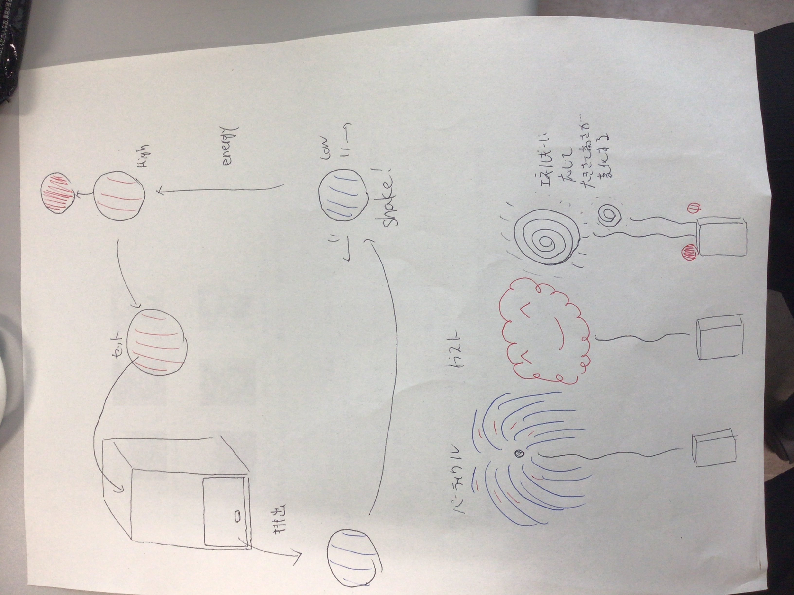

# 概要

ワークショップでは花火をテーマにした作品を制作する。ボールを花火玉に見立て、受講者は発表中に花火大会を行う。

# 花火について

## 花火の種類

1. パーティクルを利用した花火

1. イラストをもとにした花火

打ちあがる高さや花火の大きさは、後述するエネルギーの量に応じて変化する。

## 花火の打ち上げ方

1. 花火を打ち上げるためにはエネルギーが必要である。ボールを振ることで花火にエネルギーをためることができる。たまったエネルギーの量はボールの色で判断が可能である。
1. エネルギーが溜まったら、発射筒に花火をセットする。セットされた花火玉は暫くの後打ちあがり、花火がモニターに反映される。
1. 打ち上げられた花火玉は返却され、初めに戻る。

# 受講者が行うこと

## 製作時

1. 花火パーティクルの調整
1. 花火イラストの作成

## 発表時

1. 花火の打ち上げ

